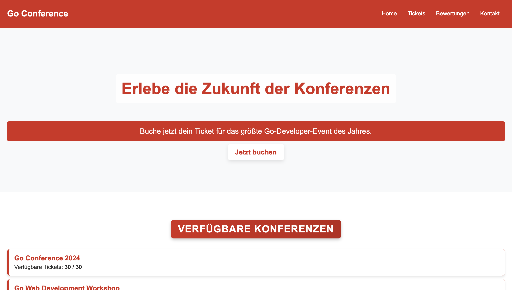
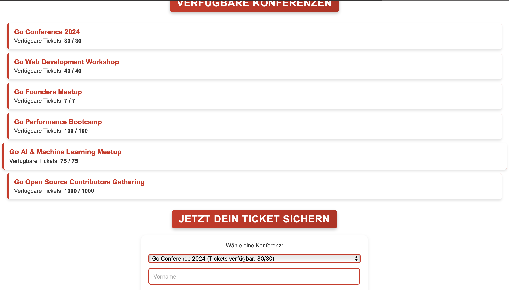

# Go Conference Booking System

Ein leichtgewichtiges Web- und API-Projekt in Go (Golang) zur Verwaltung und Buchung von Konferenzen. Nutzer können über ein benutzerfreundliches Frontend Tickets buchen, während Admins neue Meetings erstellen können. Ideal für Events, Kurse, Seminare oder Tech-Meetups.

---

## 🌟 Features

- 👥 **Mehrere Konferenzen verwalten** (Admin via POST-Route)
- 💼 **Ticketbuchung** für Konferenzen (Frontend & API)
- 📅 Live-Verfügbarkeit von Tickets
- 🌐 API-basiert mit statischem HTML/CSS/JS-Frontend
- 🚷 Validierung & Fehlerbehandlung im Backend & Frontend

---

## 📦 Installation

```bash
  # Repository klonen
  $ git clone https://github.com/Altonbekolli/booking-App.git
  $ cd booking-App
  
  # Server starten
  $ go run main.go
  
  # App ist erreichbar unter:
  http://localhost:8080
```

---

## 📊 Projektstruktur

```
booking-app/
├── main.go               # Go-Backend mit REST-API
├── go.mod                # Moduldatei
├── static/
│   ├── index.html       # HTML-Oberfläche
│   ├── css/style.css    # Styling
│   └── js/script.js     # Interaktive Funktionen
```

---

## 📄 API-Endpunkte

### Alle Meetings abrufen

```
GET /meetings
```

**Antwort:** JSON-Liste aller Konferenzen mit Ticketverfügbarkeit

### Neues Meeting erstellen (Admin)

```
POST /create-meeting
```

**Body:**

```json
{
  "title": "Go Day 2025",
  "total_tickets": 50
}
```

### Ticket buchen

```
POST /book
```

**Body:**

```json
{
  "first_name": "Max",
  "last_name": "Mustermann",
  "email": "max@example.com",
  "tickets": 2,
  "meeting_id": 1
}
```

---

## 🎨 Screenshots

| Startseite                          | Ticketbuchung                        |
|------------------------------------|--------------------------------------|
|       |        |


---

## 🌐 Verwendete Technologien

- [Go (Golang)](https://go.dev/) für Backend/API
- HTML, CSS, JavaScript (Vanilla)
- REST-API ohne Frameworks

---

## 🧳 Autor

**Alton Bekolli**\
Werkstudent Webentwicklung bei B-ite GmbH\
Kontakt: [Altonbekolli\_1@web.de](mailto\:Altonbekolli_1@web.de)

---

## ⚡ TODOs & Erweiterungsideen

- 💡 Erweiterungsideen
📧 Buchungsbestätigung per E-Mail

→ Automatisch eine Mail rausschicken mit Ticketdetails
🔐 Admin-Login mit Passwortschutz

→ Nur eingeloggte Admins können neue Meetings erstellen
📆 Kalenderintegration (Google/Outlook)

→ Mit einem Klick ins Kalender eintragen
🖼️ QR-Code fürs Ticket

→ Beim Buchen wird ein QR-Code generiert für den Check-in
📱 Mobile-Optimierung mit PWA-Support

→ App als Icon auf dem Handy – fast wie native
⏱️ Countdown bis zum Event

→ Zeigt dynamisch die verbleibende Zeit zur Konferenz
📊 Admin-Übersicht mit Statistiken

→ Wer hat gebucht, wie viele Tickets noch frei, etc.
💬 Live-Chat oder Support-Widget

→ Bei Fragen direkt Kontakt aufnehmen
🧾 Rechnungserstellung / PDF-Ticket

→ Nach Buchung automatisch ein PDF mit Ticketdaten
👯 "Bring a Friend"-Rabatt

→ Wenn man 2 oder mehr Tickets kauft, gibts Rabatt
🌍 Mehrsprachigkeit (i18n)

→ Interface auf Deutsch, Englisch usw. verfügbar
💳 Zahlungsintegration (z. B. Stripe oder PayPal)

→ Buchung direkt mit Bezahlung kombinieren
🔄 Warteliste bei ausverkauften Events

→ Wenn jemand abspringt, rutscht man nach

---

## 🚀 Lizenz

MIT License

